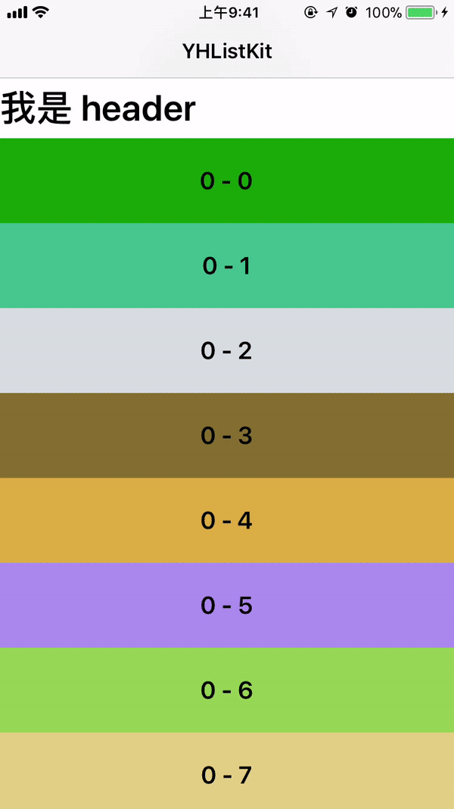
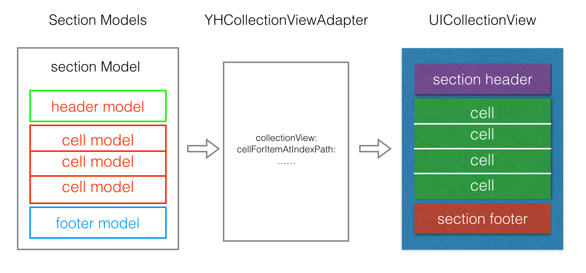

# YHListKit


[](https://juejin.im/post/5a635a586fb9a01ca071edd7)

YHListKit 是一个基于  `UICollectionView` 的、轻量级的数据驱动列表框架，其核心思想在于通过 Adapter 模式将繁琐的 `UICollectionView` 相关代理方法转变成数据驱动的接口，更贴近人类的思维方式，同时还将注册 cell 和 dequeue cell 的逻辑封装到了内部。另外，还通过借助消息转发机制，将 `UICollectionViewDelegate`、`UIScrollViewDelegate` 等代理方法由中间人转发出来，以供外面的业务方在需要时可以使用。


## 特性
- 基于 `UICollectionView` 的适配器，不需要再面对繁琐的 register -> data source -> dequeue 流程
- 真正的数据驱动
- 自动缓存 cell/section header/section footer 的高度
- 使用了面向协议的设计，去耦合
- 不需要继承，即插即用，无侵入性

## 预览效果图




## 架构



原来创建实现一个列表需要跟 UICollectionView 繁琐的 API 打交道：
> 1. 创建 UICollectionView；
> 2. 注册 cell；
> 3. 解析数据/组装数据；
> 4. 至少实现 3 个代理方法，非常繁琐；
> 5. reload data；

使用 `YHListKit` 之后只需要跟数据搞好关系：
> 1. 创建 UICollectionView；
> 2. 解析数据/组装数据（包含 view model）；
> 3. 创建 `YHCollectionViewAdapter`，传入数据，绑定 UICollectionView；
> 4.  reload data；


程序的本质就是处理数据，UI 是数据的表现层。最理想的效果就是写一个配置文件，就能看到效果。`YHListKit` 所做的就是，去掉解析数据之后的那一步，让我们只需要关心数据，就是这么简单。

类、协议		|	功能
---		|		---
YHCollectionViewCellModel、YHCollectionViewSectionModel|表征 cell、 section header 和 section footer 相关数据的 view model
YHCollectionViewAdapter| 包装 UICollectionView 代理方法的核心类，将代理回调形式的接口转换成 view model 形式的数据驱动接口
YHCollectionViewCell、YHCollectionViewSectionHeaderFooter | 定义 cell 和 section header、footer 的通用接口，用来绑定 view model 数据，以及获取高度
MessageInterceptor | 处理消息转发的拦截器


## 使用方法

#### 1. 创建 collection view（这一步跟平时使用 `UICollectionView` 的代码一样）：

``` Objective-C
self.collectionView = [[UICollectionView alloc] initWithFrame:self.view.bounds
collectionViewLayout:self.collectionViewLayout]; // 这里也可以使用自己的 layout
self.collectionView.autoresizingMask = UIViewAutoresizingFlexibleWidth | UIViewAutoresizingFlexibleHeight;
self.collectionView.backgroundColor = [UIColor colorWithRed:244 green:244 blue:244 alpha:1.0];
self.collectionView.alwaysBounceVertical = YES;
[self.view addSubview:self.collectionView];

```

#### 2. 创建 `YHCollectionViewAdapter` ，绑定 collectionView，设置代理：
``` Objective-C
self.adapter = [[YHCollectionViewAdapter alloc] init];
self.adapter.collectionView = self.collectionView;    // 绑定 collection view
self.adapter.collectionViewDelegate = self;           // 设置代理不是必需的，视业务情况而定
self.adapter.delegate = self;                         // 设置代理不是必需的，视业务情况而定
```

#### 3. 设置 view model 数据，也就是创建 section model 和 cell model，配置相关数据（注：这里仅仅是举个例子，你可以配置任何你想要展示的数据）：
``` Objective-C
NSMutableArray *sections = [NSMutableArray array];
for (int section = 0; section < 4; section++) {

	BOOL hasMultiColumns = section % 2;

    // 创建 section model
    YHCollectionViewSectionModel *sectionModel = [[YHCollectionViewSectionModel alloc] init];

    NSMutableArray *rows = [NSMutableArray array];
    for (int row = 0; row < 10; row++) {

        // 创建 cell model
        YHCollectionViewCellModel *cellModel = [[YHCollectionViewCellModel alloc] init];
        cellModel.dataModel = [NSString stringWithFormat:@"%i - %i", section, row]; // 设置 model 数据
        cellModel.cellClass = [SCCutomCollectionViewCell class];                    // 设置 cell class
        if (hasMultiColumns) {
                cellModel.cellWidth = 160;
                cellModel.cellHeight = 160;
         } else {
                cellModel.cellHeight = 70;  // 设置 cell 高度，也可以在对应的 cell 中实现相应的协议方法来实现
         }

        [rows addObject:cellModel];
    }

    sectionModel.cellModels = rows; // 设置该 section 的 cell model 集合
    sectionModel.headerClass = [SCCollectionSectionHeaderView class]; // 设置 section header 的 class
    sectionModel.headerHeight = 50;                                   // 设置 section header 的 高度
    sectionModel.footerClass = [SCCollectionSectionFooterView class]; // 设置 section footer 的 class
    sectionModel.footerHeight = 20;                                   // 设置 section footer 的 高度
    
    if (hasMultiColumns) {
       // 还可以设置 section 的一些布局参数，比如实现一行两列的效果
        sectionModel.sectionInsets = UIEdgeInsetsMake(10, 20, 10, 20);
        sectionModel.minimumLineSpacing = 15;
    }
    
    [sections addObject:sectionModel];
}

// 传入数据
self.adapter.sectionModels = sections;

[self.collectionView reloadData];
```

#### 4. 除了在 view model 层设置 cell 、 section header 和 section footer 的高度之外，还可以在对应的 view 层设置高度，只需要实现 `YHCollectionViewCell` 和 `YHCollectionViewSectionHeaderFooter` 协议中定义的方法即可：
``` Objective-C
@protocol YHCollectionViewCell <NSObject>

...

+ (CGFloat)cellHeightWithModel:(YHCollectionViewCellModel *)model;
+ (CGFloat)cellWidthWithModel:(YHCollectionViewCellModel *)model;


@end
```

``` Objective-C
@protocol YHCollectionViewSectionHeaderFooter <NSObject>

...

+ (CGFloat)heightWithModel:(YHCollectionViewSectionModel *)model;
+ (CGFloat)widthWithModel:(YHCollectionViewSectionModel *)model;

@end
```

更详细的使用介绍见示例代码 [Example](https://github.com/ShannonChenCHN/YHListKit/tree/master/Example)。

## 安装

YHListKit 可以通过 CocoaPods 安装：

```
pod 'YHListKit'
```

也可以通过手动安装，下载源代码后，将 `YHListKit` 文件夹拖到项目中即可使用。

## 系统要求
该项目最低支持 iOS 7.0。

## TODO

- [ ] 完善注释和文档
- [ ] Swift version
- [x] CocoaPods  support


## 致谢❤️
感谢 [bestswifter](https://github.com/bestswifter) 和 [IGListKit](https://github.com/Instagram/IGListKit) 带来的启发。

如果你有好的想法和问题，欢迎提 issue 和 pull request。🤝

## 许可证
该项目使用的是 MIT 许可证。 详情见 [LICENSE](https://github.com/ShannonChenCHN/YHListKit/blob/master/LICENSE) 文件。
